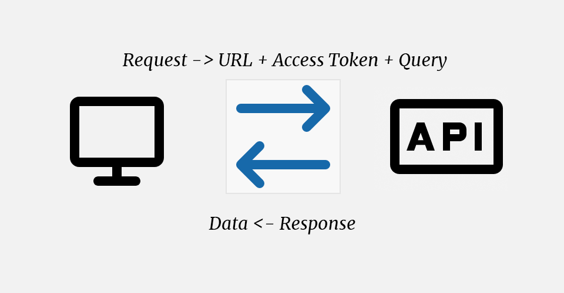
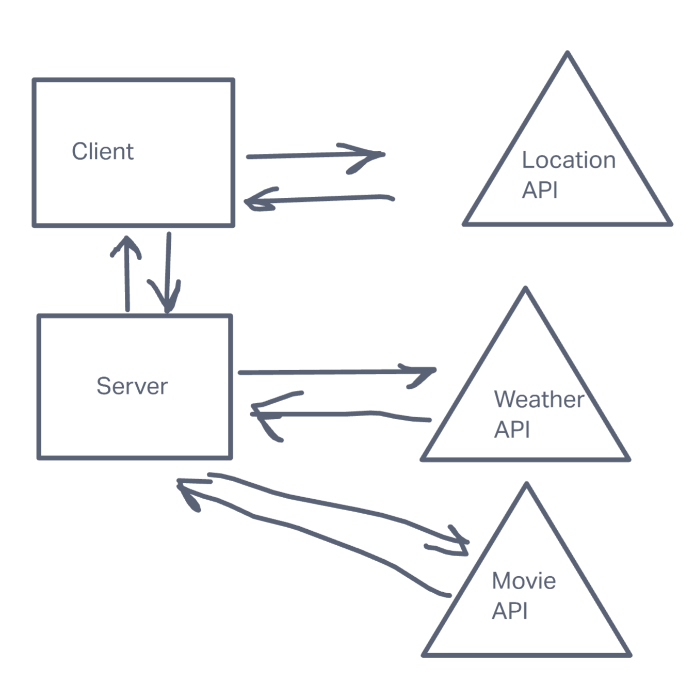

# Project Name

**Author**: Tyler Egashira + Dwight Lidquist
**Version**: 1.0.0

## Overview

This product should allow a person to search for a city and then get a map of said city. 

## Getting Started
<!-- What are the steps that a user must take in order to build this app on their own machine and get it running? -->

## Architecture
<!-- Provide a detailed description of the application design. What technologies (languages, libraries, etc) you're using, and any other relevant design information. -->

[https://locationiq.com/](Location IQ for API Key and population)
[https://react-bootstrap.github.io/](Bootstrap for React)

WRRC Functions:

1. To handle input and put input in state
2. Use state data to make an asycronous Axios call

## Change Log
 
 V.1.0.0 - Search bar functionality and map population. Error handling.
 V.1.0.1 - Added Server Call functionality.
 V.1.1.0 - Added API calls from server.
 V.1.1.1 - Refactored to make easier to read.

## Credit and Collaborations

Thanks to Chris (last name unknown) for reviewing code and helping act as a sounding board.

Dwight Linquist for being my programming partner for this.

## Time

Name of feature: Create Search function

Estimate of time needed to complete: 30min

Start time: 1:40

Finish time: 2:30

Actual time needed to complete: 50min

---

Name of feature: link Search function to use API to populate Data

Estimate of time needed to complete: 1hr

Start time: 2:30pm

Finish time: 3:50pm

Actual time needed to complete: 1hr 20min

---

Name of feature: populate map data

Estimate of time needed to complete: 30min

Start time: 3:50pm

Finish time: 6:20pm

Actual time needed to complete: 2hr 30 min

---

Name of feature: Refactor into components

Estimate of time needed to complete: 1 hour

Start time: 6:20pm

Finish time: 10:00pm

Actual time needed to complete: 3hr 40min